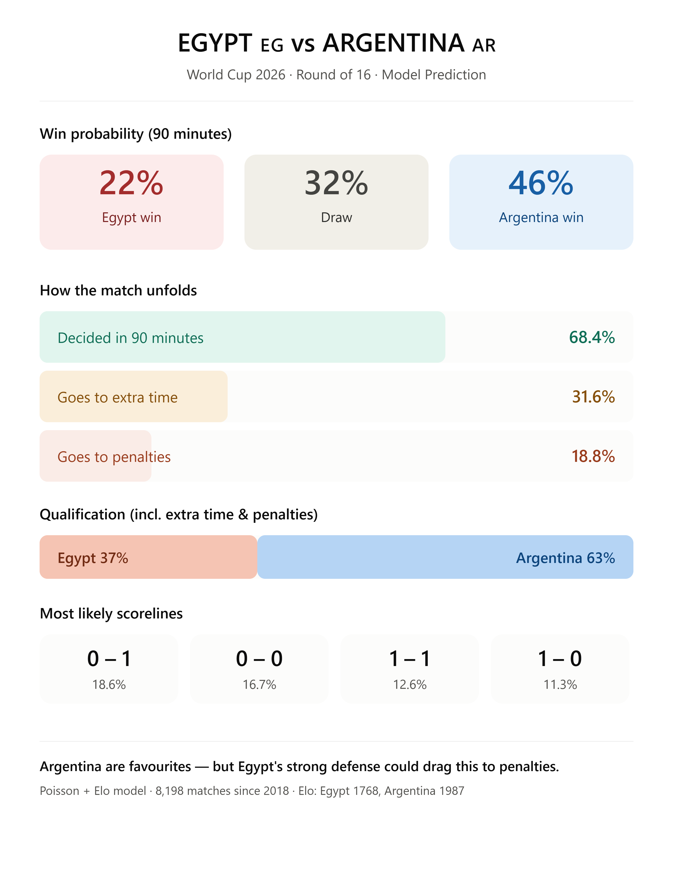

# ⚽ World Cup 2026 — Match Predictor (Poisson + Elo)

Predicting knockout matches at the FIFA World Cup 2026 using a **Poisson goals model** combined with **Elo ratings**, trained on 8,000+ international matches since 2018.

<p align="center">
  
</p>

## 📊 Example: Egypt 🇪🇬 vs Argentina 🇦🇷 (Round of 16)

| Outcome | Probability |
|---|---|
| Egypt win (90 min) | 22% |
| Draw (90 min) | 32% |
| Argentina win (90 min) | 46% |
| **Goes to penalties** | **19%** |
| Egypt qualify (incl. ET & pens) | 37% |
| Argentina qualify (incl. ET & pens) | 63% |

> Argentina are favourites — but Egypt's strong defense could drag this to penalties.

## 🧠 How it works

The model breaks each prediction into four steps:

1. **Attack & Defense strength** — how many goals each team scores and concedes, relative to the league average (1.0 = average).
2. **Poisson distribution** — converts those goal rates into the probability of every possible scoreline. Poisson is the natural fit for modelling goals: rare, independent events happening at a given rate.
3. **Elo ratings** — a chess-style rating that measures overall team strength while accounting for **opponent quality** — something raw goal counts miss (Egypt and Argentina play in different confederations against different levels of opposition).
4. **Knockout scenario** — since a knockout game can't end in a draw, the model estimates extra-time and penalty-shootout probabilities.

## 🚀 Usage

```python
# Predict any match by team name:
la_h, la_a, m = predict('Egypt', 'Argentina', neutral=True)
```

1. Download the dataset from Kaggle (link below).
2. Place the zip file in the project folder.
3. Open `WorldCup2026_Predictor.ipynb` and run all cells.

## 📁 Data

[International football results from 1872 to 2026](https://www.kaggle.com/datasets/martj42/international-football-results-from-1872-to-2017) — updated daily.

## 🛠️ Built with

Python · pandas · NumPy · SciPy · Power BI (dashboard)

## ⚠️ Disclaimer

Football is unpredictable. This model estimates probabilities from historical form — not certainties. Injuries, current form, and tournament pressure all matter. Built for learning and fun. ⚽

---
*Built by Eslam Eid Omar Hamza. Feedback welcome!*
